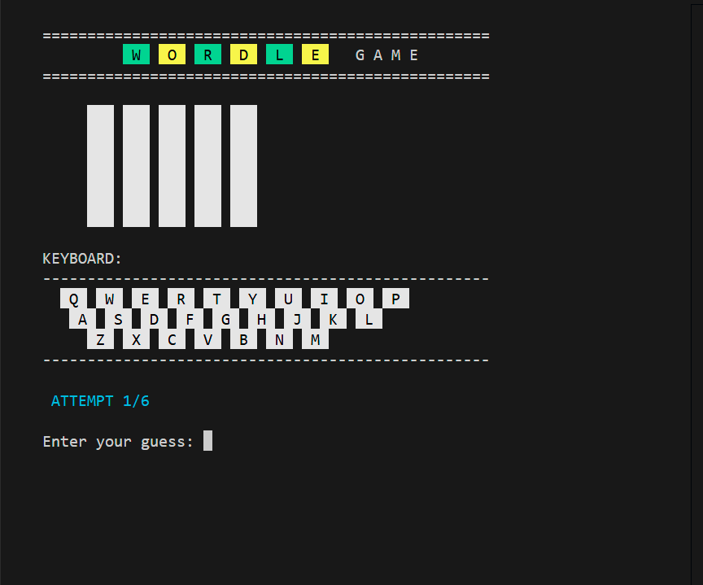
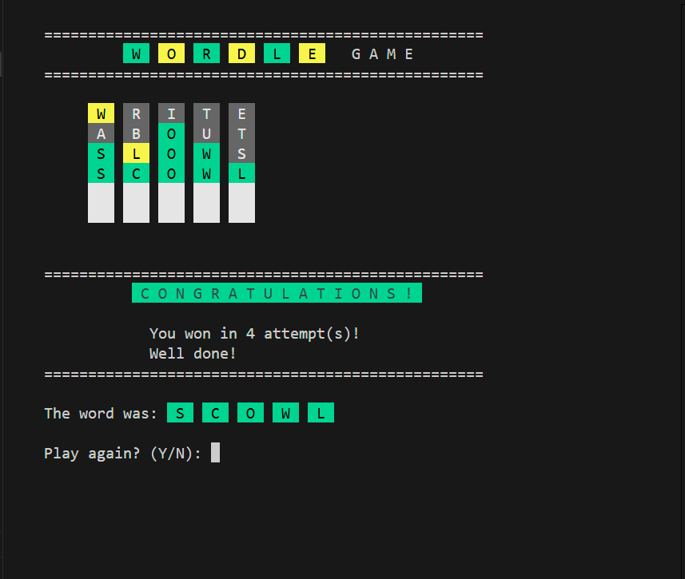
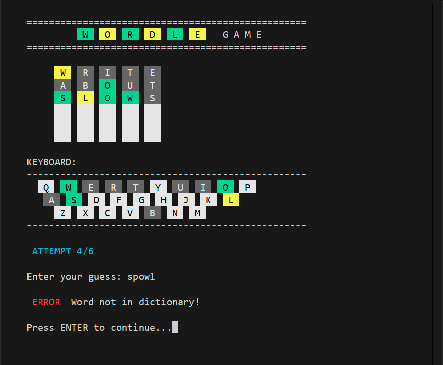
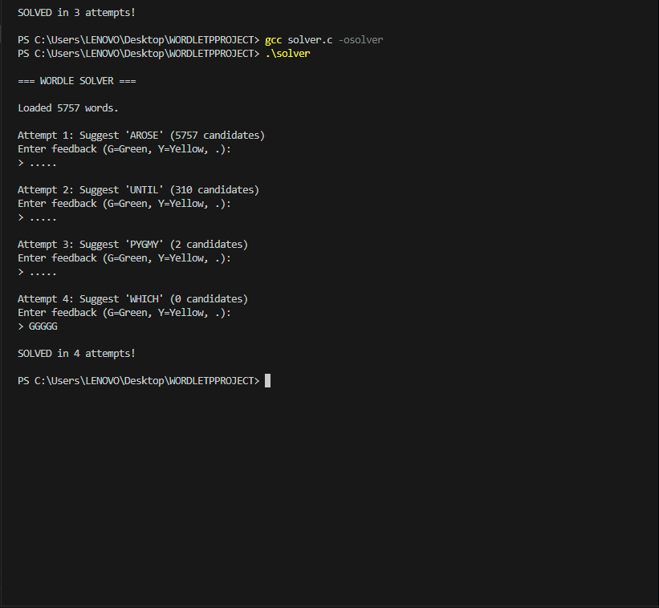

# Wordle Game and Solver (C Language)

This project implements a Wordle game and an automatic Wordle solver written in C.  
The game runs in the terminal and uses colored output to represent letter states and a dynamic on-screen keyboard.

---

## 🎮 Wordle Game

### Features
- Terminal-based Wordle game
- Colored feedback for each guess:
  - 🟩 Green: correct letter, correct position
  - 🟨 Yellow: correct letter, wrong position
  - ⬜ Grey: letter not in the word
- On-screen keyboard updated after each attempt:
  - white: not used
  - Grey: letter not in the word
  - Green / Yellow: according to guesses
- Limited number of attempts
- Random word selection from a dictionary

### Screenshots

## 🤖 Wordle Solver

The solver automatically finds the correct word by:
- Analyzing feedback from each attempt
- Eliminating impossible words
- Refining guesses based on previous results

### Screenshots

## ⚙️ How to Compile and Run

### Compile
`bash
gcc wordle_game.c -o wordle_game
gcc solver.c -o solver
